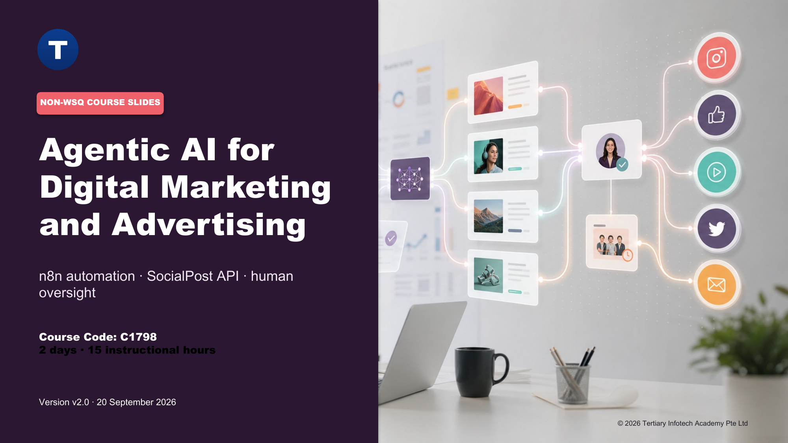
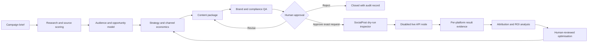

# Agentic AI for Digital Marketing and Advertising

Build governed, measurable digital-marketing automations with n8n and publish approved social content through the SocialPost API.

| Course detail | Current information |
|---|---|
| Course code | **C1798** |
| Programme | Non-WSQ short course |
| Duration | 2 days / 15 instructional hours (9:30am - 5:30pm) |
| Courseware version | **v2.0 · 20 September 2026** |
| Registration | [Tertiary Courses course page](https://www.tertiarycourses.com.sg/agentic-ai-for-digital-marketing-and-advertising.html) |

## What learners build

The connected lab journey turns a campaign brief into an evidence-led strategy, channel content, governed approval, SocialPost-ready API request, retained publication evidence, attribution analysis, and bounded optimisation proposal. The workflows use synthetic data and import inactive so learners can inspect every decision safely.

By the end of the course, learners can:

- structure research evidence, audience signals, objectives, KPIs, and campaign economics;
- produce channel-specific content while preserving claim and source lineage;
- implement brand, compliance, approval, idempotency, and audit controls in n8n;
- map approved text, photo, and video content to the documented SocialPost multipart endpoints;
- analyse performance events, ROI, anomalies, and human-reviewed optimisation actions.

## Automation architecture

The Lab 11 HTTP Request node points to the documented SocialPost API but remains disabled. A local inspector validates the endpoint, multipart fields, approval binding, and idempotency key without transmitting content. A trainer may authorise one sandbox call after learners store the API key in n8n Credentials.

## Connected lab journey

| Lab | Outcome |
|---:|---|
| 01 | Capture a campaign brief and define a KPI contract |
| 02 | Research and score evidence sources |
| 03 | Synthesise audience signals and rank opportunities |
| 04 | Produce a RACE/SOSTAC strategy model |
| 05 | Simulate channel budget, unit economics, and ROI |
| 06 | Build a campaign backlog and experiment design |
| 07 | Convert strategy into a governed content prompt contract |
| 08 | Generate a SocialPost-ready multi-channel content package |
| 09 | Apply brand, claim, and compliance checks |
| 10 | Approve the exact endpoint, profile, platforms, and payload hash |
| 11 | Validate SocialPost text, photo, and video API requests with idempotency |
| 12 | Orchestrate the end-to-end campaign flow |
| 13 | Ingest retained platform-result fixtures and attribute outcomes |
| 14 | Build an ROI dashboard and anomaly detector |
| 15 | Complete the governed optimisation-loop capstone |

## Public package

- `courseware/Agentic AI for Digital Marketing and Advertising-v2.0.pdf` — visual learner-facing slide deck.
- `courseware/LG-Agentic AI for Digital Marketing and Advertising.pdf` — detailed concepts, setup, lab steps, troubleshooting, and acceptance checks.
- `courseware/LP-Agentic AI for Digital Marketing and Advertising.pdf` — aligned two-day delivery plan.
- `LG-Agentic AI for Digital Marketing and Advertising.md` — accessible Learner Guide source.
- `labs/` — 15 self-contained n8n labs with importable workflow JSON, synthetic Excel data, evidence checklists, starter notes, and expected outputs.

Open a lab folder, read its `README.md`, import `workflow.json` into n8n, and use the workbook in `data/`. Keep all API keys in n8n Credentials or another secret manager; never paste secrets into a workflow export.

## Privacy boundary

The public repository contains learner-safe course materials only. Learner submissions, credentials, reference ebooks, internal QA evidence, and environment files are excluded.

Course provider: **Tertiary Infotech Academy Pte. Ltd.**
